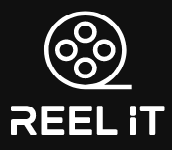

### :sparkles::movie_camera: _Offering a new way to navigate the cinematic landscape_ :movie_camera::sparkles:

> [Reel It – Heroku](https://reel-it.herokuapp.com/)

> [Reel It – GitHub Pages](https://swords-in-the-darkness.github.io/ReelIt/)

## Concept
Inspired by community-built databases informed by user-generated content, _Reel It_ provides movie info that extends beyond the credits and critics. 

Currently, _Reel It_ allows users to search Movie Titles — rendering robust details including:
* Plot 
* Cast/crew 
* FCC rating 
* Release date
* Trailers
* Audience Ratings & Reviews
* Direct links to purchase, rent, or stream movies 
* Additional options to narrow or expand one's search based on genre, cast/crew, recommendations, popular videos, and related content. 

## Future Directions
* Expand search categories to include TV shows, albums, podcasts, books, and more. 
* Allow users to create account where they can submit reviews and provide ratings.
* Allow users to select from an autocomplete suggestion drop-down menu of relevant and validated search criteria. 

## Technologies
* HTML
* CSS (Bootstrap, Google Fonts)
* JavaScript/jQuery
* JSON/JSONP
* AJAX

### APIs & DBs
* [TMDB](http://www.tmdb.org/) The Movie Database - primary source for  movie data.
* [YouTube](https://developers.google.com/youtube/) - provides video reviews, trending related videos, and movie trailers.
* [iTunes](https://www.apple.com/itunes/working-itunes/) - provides users with the option to rent or purchase movies via iTunes.
* [Firebase](https://firebase.google.com/) - monitors activity, allows users to revisit most recent searches.

### Additional Libraries & Build Tools
* [Validate.js](https://validatejs.org/) - user input validation
* [Chardin.js](https://heelhook.github.io/chardin.js/) - simple overlay instructions for your app 
* [GitHub Desktop](https://desktop.github.com)
* Sublime Text

## Authors

[@ero646](https://github.com/ero646)

[@jrapala](https://github.com/jrapala)

[@rescarra](https://github.com/rescarra)

[@vanarothorn](https://github.com/vanarothorn)

## Acknowledgments :clap: :clap:
* YouTube, iTunes, and TMDB for providing us with ample content and zero fuss.
* canistream.it for directing users to sources for streaming content (legally)
* Professors & TAs @ NU
* Users! After all, this app was designed for ya'll

_**Reel It was created to meet the following objectives, as delineated for Project 1**_
* Integrate functionaility across 2+ APIs using AJAX to pull data 
* Meet good quality coding standards 
* Polished UI 
* User input validation 
* Utilize persistent data storage 
* Mobile responsive

> _**Disclaimer:** While this project uses TMDb, YouTube, and iTunes APIs, it is not endorsed or certified by TMDb, YouTube, or iTunes._

